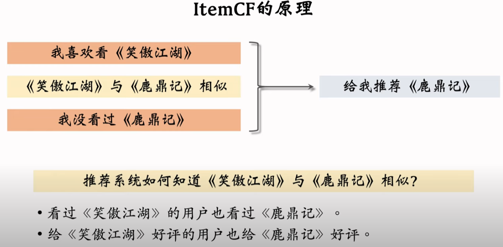

# 召回

## 协同过滤召回

### itemCF
原理：根据物品的相似性进行推荐

给用户推荐已选用过物品的相似物品，通过KG、或用户的行为。
如用户1选用物品1，用户2选用物品1的同时也选用了物品2。

打分：
基于训练数据中用户和物品的rating，计算物品之间的相似度，来推测用户对候选物品的兴趣得分大小。
#### user对item的兴趣得分
    ∑j like(user,itemj)sim(itemj,item)

物品间相似度计算方法：
基本概念为被相似的用户群体喜欢
物品i1和物品i2的相似度--
实际上是喜欢i1的用户向量与喜欢i2的用户向量的cos相似度。
* 变体swing，计算相似度时排除小圈子任务目标的影响，若V中的用户在小圈子内（有更多的重叠物品倾向），则相似度会偏低，α为超参数。

召回：
用户喜欢物品的TOP-k相似物品倒排作为召回结果进入pipeline的下一步。

### userCF
原理：根据用户的相似性进行推荐

打分：
基于训练数据中用户和物品的rating，计算用户之间的相似度，来推测用户对候选物品的兴趣得分大小。 
#### user对item的兴趣得分
    ∑j sim(user,userj)*like(userj,item)

用户间相似度计算方法：
基本概念为喜欢的物品集合相似
* 用户u1喜欢的物品记为J1
* 用户u2喜欢的物品记为J2
* 交集I = J1∩J2
#### tier1：两个用户的相似度
    sim(u1,u2) = |I|/√|J1|·|J2|

* nl为喜欢物品l的数量，反应物品的热门程度
#### tier2：降低热门物品权重
    sim(u1,u2) = ∑l∈I 1/log(1+nl)/√|J1|·|J2|

召回：
用户喜欢物品的TOP-k相似物品倒排作为召回结果进入pipeline的下一步。

## 向量召回

### 矩阵补充，最近邻查找
用户id和物品id向量化，训练用户id向量矩阵A和物品id向量矩阵B。
有监督训练，让真实rating接近物品和用户的向量相似度（内积）。最小化预测值和真实值的差。

为什么叫矩阵补充？
* 行作为用户，列作为物品，构成的矩阵为稀疏的，补充其实就是推荐的过程，给用户图鉴分数高的。

效果不好？ 
* 仅使用ID embedding，没利用物品用户的属性特征
* 负样本的选取方式不对，曝光后未选择的作为负样本，是错误做法
* 训练方法不好：内积不如cos， 平方损失（回归）不如交叉熵（分类）

最近邻查找算法？
* 要避免暴力枚举，因为物品可能很多
* 根据距离度量方法不同，划分向量空间，并记录索引
* 只用计算跟索引的相似度即可

### 双塔模型（DSSM）

# 排序

# 冷启动策略