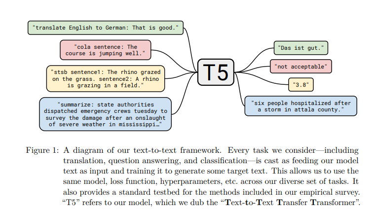
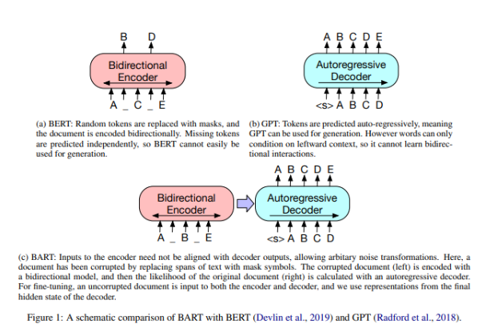
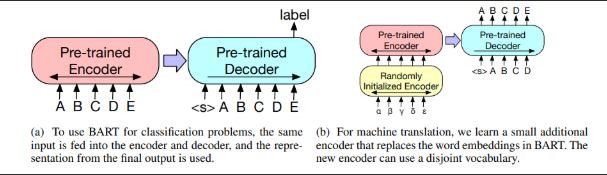

最近正在做信息抽取方向的工作，想要了解目前使用率高、易于落地且公认效果比较好的baseline模型，以便进行之后的相关工作。

经了解抽取任务的强baseline主要是生成式模型，具体代表为以下模型：
* T5：[https://arxiv.org/pdf/1910.10683.pdf]()  
* BART：[https://arxiv.org/pdf/1910.13461.pdf]()

自回归(autoregressive)语言模型，如GPT，采用从左向右单向解码的方式，适用于自然语言生成（NLG）任务。非自回归(non-autoregressive)语言模型，如BERT，每个时刻的输出都可以充分利用双向信息，适用于自然语言理解（NLU）任务，但是在NLG上表现不佳。下文将介绍的两篇文章尝试在保留语言模型的自回归特性的情况下兼具上下文信息的学习，使预训练模型具备解决生成式任务能力的同事也能很好的解决NLU任务。

### T5：Exploring the Limits of Transfer Learning with a Unified Text-to-Text Transformer
T5是“Text-to-Text Transfer Transformer”的简称，Transfer来自Transfer learning，文中提到NLP领域的预训练模型都涉及transfer learning的范畴，并经历了RNN到transformer的发展。

作者提出了一个统一框架，试图将所有的NLP任务都转化为Text-to-text（文本到文本）任务。
如图所示，比如英德翻译，只需将训练数据集的输入部分前加上“translate English to German（给我从英语翻译成德语）” 就行。假设需要翻译"That is good"，那么先转换成 "translate English to German：That is good." 输入模型，之后就可以直接输出德语翻译 “Das ist gut.”
再比如情感分类任务，输入"sentiment：This movie is terrible!"，前面直接加上 “sentiment：”，然后就能输出结果“negative（负面）”。
将各种NLP任务转换为模型文本输入模型，训练模型去生成目标文本。这让用同一个模型、损失函数和超参数去解决不同的任务成为可能。

#### Training
作者们实验了多种预训练模型结构、多种预训练目标、文本破坏的trick以及文本破坏占比，最终确定了如下的训练方法：
* transformer encoder-decoder模型
* BERT-style式预训练目标（将文本的一部分破坏掉，然后还原出来）
* replace span策略（使用MASK符号替换一小段文本）
* 15%的破坏比，破坏span长度为3

#### Fine-tuning
上文提到过，T5想要做一个统一的框架把分类任务和生成任务统一起来，所有任务都视为生成任务。（这里用T5实现问答来实践T5的fine-tuning方式）

### BART: Denoising Sequence-to-Sequence Pre-training for Natural Language Generation, Translation, and Comprehension

BART（Bidirectional and Auto-Regressive Transformers），即既考虑了双向的上下文信息，又具有自回归特性的transformers，与我们上文提到想解决的问题基本一致。

#### Training
基本结构其实近似于BERT+GPT的结合体，采用encoder-decoder的结构，其encoder端的输入是加了MASK的序列，decoder端的输入是加噪编码后的序列，decoder端的目标是原序列。模型设计的目的很明确，就是在利用encoder端的双向建模能力的同时，保留自回归的特性，以适用于生成任务。BART本质上是一个对文本破坏再重建的预训练模型。
BART最终使用Text Infilling + Sentence permutation，其中Text Infilling起到了最主要的作用，其实就是Span级别的mask，只不过这里允许span长度为0，span的长度服从泊松分布，lambda = 3，总共mask30%的字符。Sentence permutation提升不大，之所以使用是作者假设模型规模提升后这个任务会有用。

#### Fine-tuning

* 解决分类问题时，如上图左所示，将相同的输入送进encoder和decoder，使用decoder最后的隐层输出表示进入分类器做分类。（这里我的理解是，在做分类任务时，直接用预训练模型表示待分类的文本即可）
* 解决序列生成任务时，如问答和摘要任务，encoder输入句子，decoder自回归式的生成回答。（原文中没有描述具体的fine-tuning操作，我认为需要新的小训练集对模型进行微调，再投入实际使用）
* 解决机器翻译问题时，如上图右所示，由于翻译任务的词表可能和模型词表不同，所以这里使用一个新的小型encoder替换BART中的Embedding

#### 待学习
事件抽取的强baseline为ACL2022的UIE：[https://arxiv.org/abs/2203.12277]()，在最近的工作中已经验证了UIE的效果，处理较复杂的事件抽取任务，在少量数据的微调下，UIE可以得到较好的抽取效果。